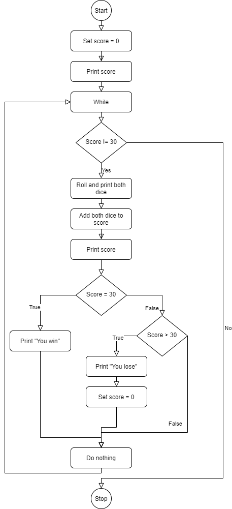

# CSC160

## Dice Game: 30 or Bust!
### The goal of the game is to reach a score of exactly 30.

Each player has two dice. The players take turns rolling their dice. When a player rolls both dice, the player may keep the total of both dice or the face value of either die to add to that players total. A player MUST select either the face value of one of the dice, or the total value of both dice. If a player's score goes over 30, then that player's score is reset to zero and play continues until one player obtains a score of exactly 30. The first player to score exactly 30 is the Winner.

- Your code should allow for two players.
- Your code should obtain the players' names and print a personalized welcome to the game.

The first player's name and starting score of zero should be displayed. The game should roll two dice for the player and display the face value of each die and the total value of both dice. The first player is then required to pick the face value of one of the dice or the total value of both dice. This value is added to that player's score. The new player score is displayed.

 - If the player's score is less than 30, the turn is passed to the other player.
 - If the player's score is greater than 30, then the player score is reset to zero and the turn is passed to the other player.
 - If the player's score is exactly 30, then that player is declared the winner.

